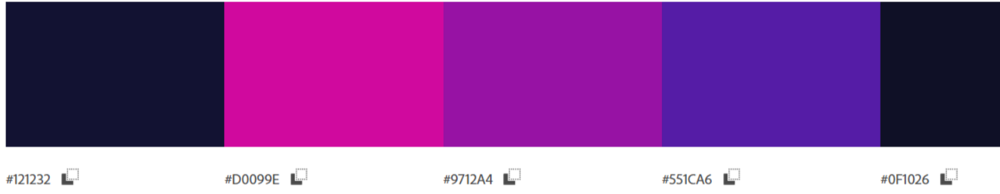

# grupo_5_DreamProgrammer

Proyecto Dream Programmer

pagina e-learning de desarrollo Web Full Stack.
Dream Programmer es una pagina enfocada en organizar y educar sobre el mundo tech, principalmente en tecnologías y habilidades altamente demandadas. Siendo una plataforma colaborativa e innovadora sobre el desarrollo de software, base de datos y
el proceso de elaboración de diferentes productos tecnológicos, además de ayudar en el crecimiento técnico de sus usuarios brindándoles diferentes perfiles a
corde a sus funciones y deseos de formación.
Nuestra web esta dividida en 5 secciones principal donde podran
navegar y encontrar informacion relacionada a los cursos que se ofrecemos.
A continuacion enumeramos y damos una breve descripcion de cada una de ellas:

1.- Home: Sera la portada de nuestra web, en la seccion home encontraremos un navegador
con las diferentes secciones de la pagina, una breve reseña del objetivo y mision a lograr ademas de enlaces
directos hacia algunos de los cursos propuestos, al finalizar nos encontraremos con algunas experiencias de estudiantes
con la plataforma e informacion institucional sobre donde nos pueden ubicar en otras plataformas.

2.- Login: Este apartado se ubica tambien en la pantalla inicial, al seleccionarlo se mostrara un formulario donde se solicitaran correo electronico valido y contraseña para dar acceso de forma unica
y personal a los cursos y actividades propuestas para dicho usuario. Ademas una seccion de registro para nuevos estudiantes y opcion para recuperar credenciales de acceso.

3.- Seccion Cursos: En este apartado encontraremos el listado de cursos propuestos, abarcando diferentes tecnologias y niveles de aprendizaje.
Por cada lenguaje se presenta ademas del simbolo discriptivo mas reconocido del mismo, una reseña del lenguaje y los objetivos planteados para el momento de finalizado el mismo, de esta forma, cada estudiante
sabra que esperar al finalizar la curzada.

4.- Interface-cursos: Sera una de las secciones con mas proposito dentro de nuestra web, ya que aca se mostraran las diferentes herramientas para la ejecucion de la cursada, por ejemplo: videos, imagenes,
archivos PDF, etc. Contando con una seccion donde se visualize el progreso del curso en formato de barra y adicional una seccion donde los estudiantes puedan ver el temario de todo el curso de forma individual, indicando
en que momento inicia el tema que esta interesado en ver, repasar o adelantar.

5.- Actividades: Se ubica en la interface de cursos. En la seccion actividades vamos a poder practicar lo aprendido en los cursos realizados, de forma individual por curso o integrando varias tecnologias, siendo esta herramienta un
complemento valioso en el aprendizaje del estudiantes y una guia para los docentes sobre los temas a reforzar.

En el proceso de investigacion para la realizacion del wireframe consultamos diferentes web con la misma tematica, entre ellas podemos mencionar:

<ul>
<li>*https://platzi.com/</li>
<li>*https://www.sololearn.com/home</li>
<li>*https://www.udemy.com/</li>
<li>*https://www.educacionit.com/</li>: 
</ul>

Tomamos como inspiracion *sololearn* y *educacionIt*  al momento de armar la sección cursos que mostrara cada lenguaje, queriamos que fuera claro y conciso, y que en una sola pantalla se pudieran ver todas las opciones.
Elegimos *udemy* ya que una vez ingresado al curso la interface muestre el progreso por temario de forma que el estudiante pueda adelantar o retroceder los videos o actividades dependiendo de sus necesidades.
Ademas, tomamos como referencia el menu lateral para una mejor visualización de todos los videos.
De *platzi* nos gusto la forma en la que la pagina brinda rutas de aprendizaje definidas y como el usuario puede elegir una propia.

## Paleta de Colores
La paleta de colores y la fuente fueron elegidas tomando en consideración la identidad corporativa del cliente y en armonia con la funcionalidad de la pagina.

<ul>
<li>#232340</li>
<li>#D0090E</li>
<li>#9712A4</li>
<li>#551CA6</li>
<li>#0F1026</li>

</ul>

## Fuentes:
<ul>
<li>font-family: 'Inter', sans-serif</li>
<li>font-family: 'Roboto', sans-serif</li>
<li>font-family: 'Rubik', sans-serif</li>
</ul>

